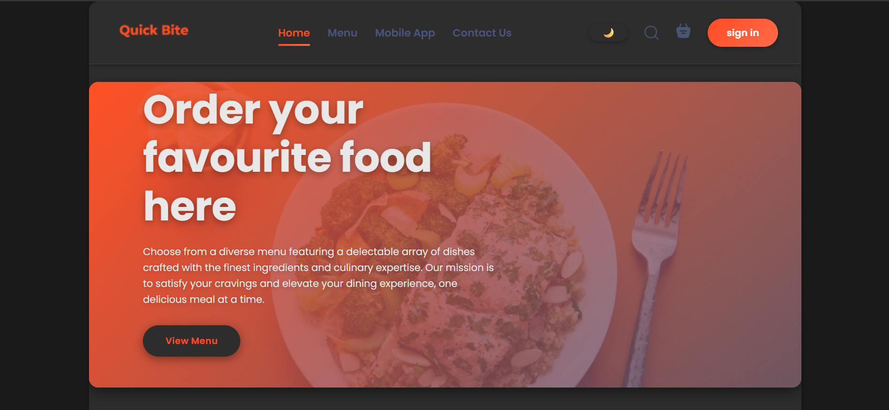
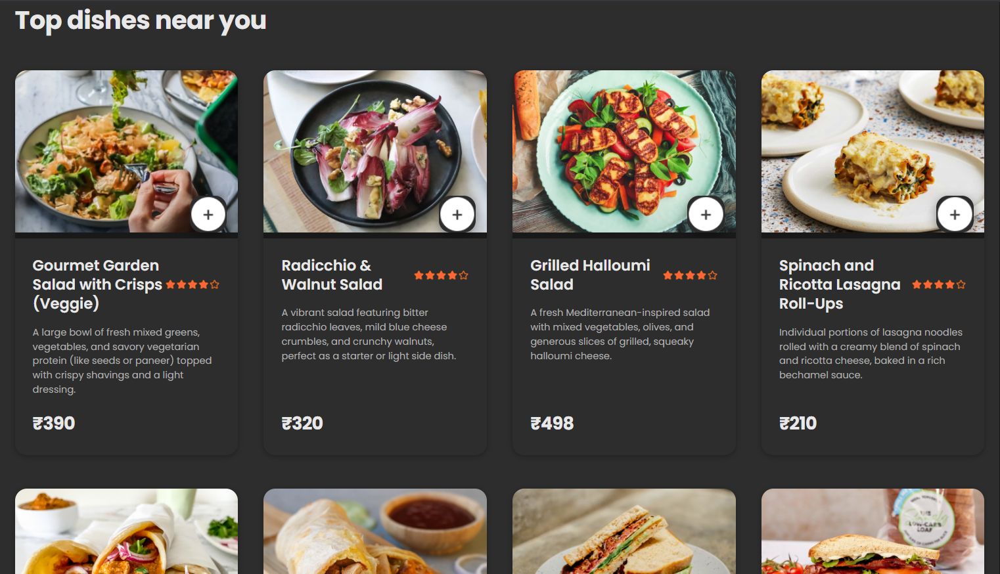
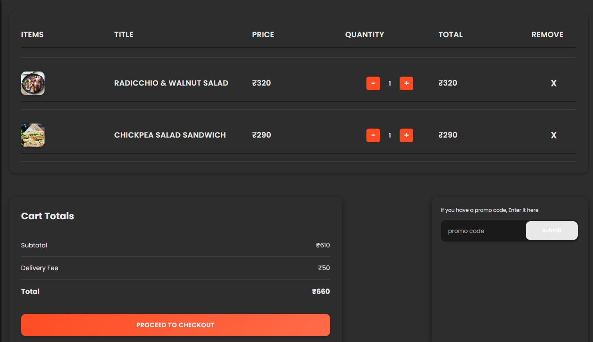
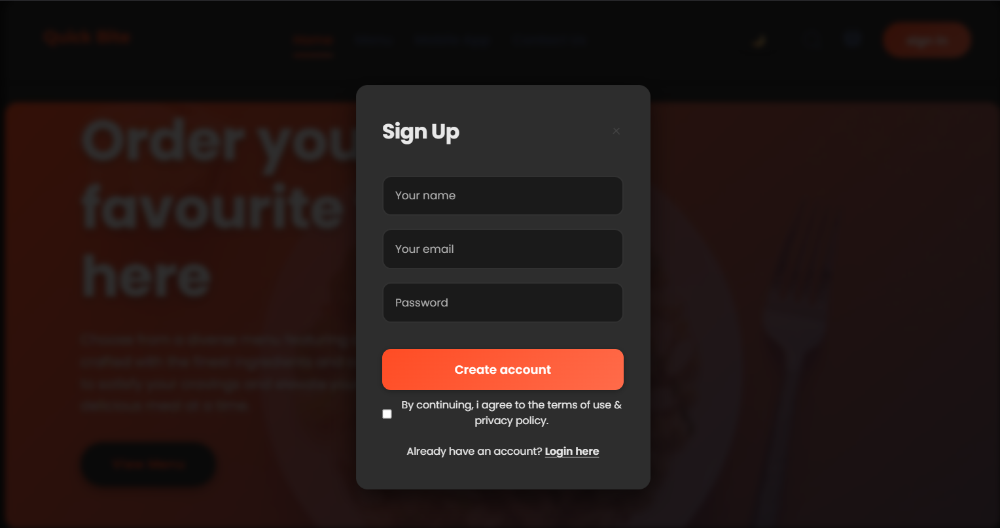

# Quick Bite - Food Ordering Website

Welcome to Quick Bite, a sophisticated and dynamic food ordering website crafted using the MERN stack. Designed with user experience in mind, Quick Bite offers a seamless and intuitive online food ordering journey.

## Demo

- User Panel: [Access Here](https://food-del-frontend-2l5h.onrender.com)
- Admin Panel: [Access Here](https://food-del-admin-0gnt.onrender.com)

## Features

- Responsive **User Panel** for effortless browsing and ordering
  
- Comprehensive **Admin Panel** for managing products and orders  
- Secure **JWT Authentication** & **Password Hashing** via Bcrypt  
- Smooth **Stripe Payment Integration** for hassle-free transactions  
- User-friendly **Login**, **Signup**, and **Logout** flows  
- Dynamic **Add to Cart** and **Place Order** functionality  
- Robust **Order Management** and **Product Management** tools  
- Advanced **Food Product Filtering** for quick searches  
- Role-based access control with **Authenticated REST APIs**  
- Elegant and informative **Alert Notifications**
-Elegant and informative Alert Notifications

## Screenshots

- Hero Section
  


- Products Section
  


- Cart Page
  


- Signup Popup
  



## Run Locally

Clone the project

```bash
    git clone https://github.com/ShreyasGujarathi/food-del
```
Go to the project directory

```bash
    cd food-del
```
Install dependencies (frontend)

```bash
    cd frontend
    npm install
```
Install dependencies (admin)

```bash
    cd admin
    npm install
```
Install dependencies (backend)

```bash
    cd backend
    npm install
```
Setup Environment Vaiables

```Make .env file in "backend" folder and store environment Variables
  JWT_SECRET=YOUR_SECRET_TEXT
  SALT=YOUR_SALT_VALUE
  MONGO_URL=YOUR_DATABASE_URL
  STRIPE_SECRET_KEY=YOUR_KEY
 ```

Setup the Frontend and Backend URL
   - App.jsx in Admin folder
      const url = YOUR_BACKEND_URL
     
  - StoreContext.js in Frontend folder
      const url = YOUR_BACKEND_URL

  - orderController in Backend folder
      const frontend_url = YOUR_FRONTEND_URL 

Start the Backend server

```bash
    nodemon server.js
```

Start the Frontend server

```bash
    npm start
```

Start the Backend server

```bash
    npm start
```
## Tech Stack
* [React](https://reactjs.org/)
* [Node.js](https://nodejs.org/en)
* [Express.js](https://expressjs.com/)
* [Mongodb](https://www.mongodb.com/)
* [Stripe](https://stripe.com/)
* [JWT-Authentication](https://jwt.io/introduction)
* [Multer](https://www.npmjs.com/package/multer)

## Deployment

The application is deployed on Render.

## Contributing

Contributions are always welcome!
Just raise an issue, and we will discuss it.

## Feedback

If you have any feedback, please reach out to me [here]
